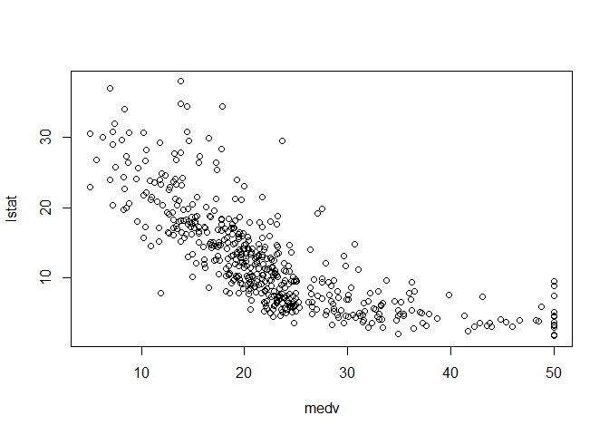

R Markdown Example
------------------

``` r
library(MASS)
attach(Boston)
summary(Boston)
```

    ##       crim                zn             indus            chas        
    ##  Min.   : 0.00632   Min.   :  0.00   Min.   : 0.46   Min.   :0.00000  
    ##  1st Qu.: 0.08205   1st Qu.:  0.00   1st Qu.: 5.19   1st Qu.:0.00000  
    ##  Median : 0.25651   Median :  0.00   Median : 9.69   Median :0.00000  
    ##  Mean   : 3.61352   Mean   : 11.36   Mean   :11.14   Mean   :0.06917  
    ##  3rd Qu.: 3.67708   3rd Qu.: 12.50   3rd Qu.:18.10   3rd Qu.:0.00000  
    ##  Max.   :88.97620   Max.   :100.00   Max.   :27.74   Max.   :1.00000  
    ##       nox               rm             age              dis        
    ##  Min.   :0.3850   Min.   :3.561   Min.   :  2.90   Min.   : 1.130  
    ##  1st Qu.:0.4490   1st Qu.:5.886   1st Qu.: 45.02   1st Qu.: 2.100  
    ##  Median :0.5380   Median :6.208   Median : 77.50   Median : 3.207  
    ##  Mean   :0.5547   Mean   :6.285   Mean   : 68.57   Mean   : 3.795  
    ##  3rd Qu.:0.6240   3rd Qu.:6.623   3rd Qu.: 94.08   3rd Qu.: 5.188  
    ##  Max.   :0.8710   Max.   :8.780   Max.   :100.00   Max.   :12.127  
    ##       rad              tax           ptratio          black       
    ##  Min.   : 1.000   Min.   :187.0   Min.   :12.60   Min.   :  0.32  
    ##  1st Qu.: 4.000   1st Qu.:279.0   1st Qu.:17.40   1st Qu.:375.38  
    ##  Median : 5.000   Median :330.0   Median :19.05   Median :391.44  
    ##  Mean   : 9.549   Mean   :408.2   Mean   :18.46   Mean   :356.67  
    ##  3rd Qu.:24.000   3rd Qu.:666.0   3rd Qu.:20.20   3rd Qu.:396.23  
    ##  Max.   :24.000   Max.   :711.0   Max.   :22.00   Max.   :396.90  
    ##      lstat            medv      
    ##  Min.   : 1.73   Min.   : 5.00  
    ##  1st Qu.: 6.95   1st Qu.:17.02  
    ##  Median :11.36   Median :21.20  
    ##  Mean   :12.65   Mean   :22.53  
    ##  3rd Qu.:16.95   3rd Qu.:25.00  
    ##  Max.   :37.97   Max.   :50.00

Plot
----


